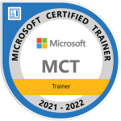

# Vlad DX

<!--  -->

**Architect and Experienced Software Engineer**

- 🚩 Main focus: Engineering Leadership, Enterprise/Solution Architecture, ERP; Stakeholder, Risk, and Expectations Management; Azure, APIs, Integrations, IAM, and problem-solving.
- ☑ Prefer to work with mature Product Teams applying DevOps/SRE practices.
- ⚡ Microsoft Certified Trainer, Microsoft Certified Professional.

 

Has 15+ years in software development and 20+ years of working experience in IT.

Fun fact: dealing with computers for about 30 years.

Mentoring: conducted 190h+ of sessions since 2015.

## Certifications

## Stackoverflow

## Author / Trainer

### Libraries

#### Xtz.StronglyTyped

[Xtz.StronglyTyped repository](https://github.com/dev-experience/Xtz.StronglyTyped)

> Set of NuGet packages to strongly-type your interfaces (properties, methods, APIs, DB entities, appsettings).
>
> Eliminate stringly-typed interfaces.
>
> Make compiler your friend, introduce semantics to your code.

| NuGet Package                                  | Version                                                                                                                                                              |
| ---------------------------------------------- | -------------------------------------------------------------------------------------------------------------------------------------------------------------------- |
| **Xtz.StornglyTyped**                          |                                                    |
| **Xtz.StronglyTyped.BuiltinTypes**             |                          |
| **Xtz.StornglyTyped.BuiltinTypes.AutoFixture** |  |
| **Xtz.StornglyTyped.BuiltinTypes.Bogus**       |              |
| **Xtz.StornglyTyped.EntityFramework**          |                    |
| **Xtz.StornglyTyped.SourceGenerator**          |                    |
| **Xtz.StornglyTyped.Swashbuckle**              |                            |

#### Sample projects

Checkout sample projects with use cases: [Xtz.StronglyTyped.SampleProjects](https://github.com/dev-experience/Xtz.StronglyTyped.SampleProjects)

### Courses

- [Extenza Academy WebDev-100 Course](https://github.com/Extenza-Academy/WebDev-100_2021-Q1)

  
  

- AZ-900 - Azure Fundamentals

  
  

- AZ-204 - Developing Solutions for Microsoft Azure

  
  
